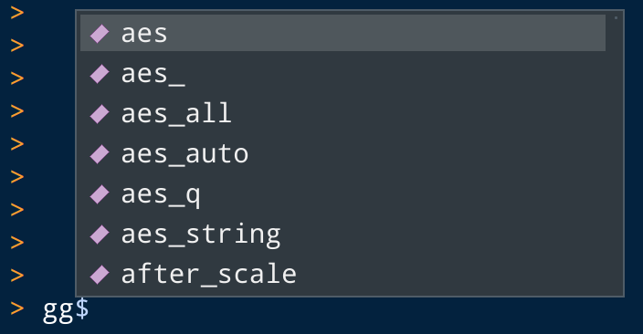

```{r setup, include=FALSE}
library(importas)
`%>%` <- magrittr::`%>%`
```


```{r knitr, include=FALSE}
library(knitr)
opts_chunk$set(
  collapse = TRUE, comment = "#>"
)
```
# {#self-intro}


::: {.col style='width:300px'}

### ***Atusy***

{width=300px}

:::

::: {.col style='width:600px'}

* R Markdown関係のコミッタ
* felp、ftExtra、minidownなどパッケージを作ってはTokyoRで紹介している
* Pythonでデータ分析してる
* 
  [blog.atusy.net](https://blog.atusy.net)
* 
  [\@Atsushi776](https://twitter.com/Atsushi776)

:::

# 提供

[](https://github.com/sponsors/atusy)

<https://github.com/sponsors/atusy>

# パッケージの干渉👎 {#conflicts}

```{r, include=FALSE}
library(dplyr)
library(MASS)
```


```{r, error=TRUE}
mtcars %>% select(mpg)
```
## 入れ替わってる？！

```{r}
select
```


# パッケージ::関数👎 {#avoid-conflicts}

正直だるい

```{r, fig.height=2}
ggplot2::ggplot(mtcars) +
  ggplot2::aes(wt, mpg) +
  ggplot2::geom_point() +
  ggplot2::theme_classic()
```


# Pythonのアレが欲しい  {#python}


```{python}
import datetime as dt
dt.date(2020, 9, 19)
```

# 📦importas🎉

```{r, eval=FALSE}
remotes::install_github("atusy/importas")
```

CRAN登録は間に合いませんでした……。

スマン！！

## Python風 {#like-python}

```{r, fig.height=2}
ggplot2 %as% gg
gg$ggplot(mtcars) +
  gg$aes(wt, mpg) +
  gg$geom_point() +
  gg$theme_classic()
```

## R風 {#like-r}

```{r, fig.height=2}
gg <- package(ggplot2)
gg$ggplot(mtcars) +
  gg$aes(wt, mpg) +
  gg$geom_point() +
  gg$theme_classic()
```

## 複数に同時

```{r}
importas(tb = tibble, td = tidyr)
`%>%` <- magrittr::`%>%`

tb$rownames_to_column(mtcars) %>%
  td$nest(data = -rowname)
```


# 入力補完に対応




# 完全一致のみ許可

```{r, error=TRUE}
gg$ggplo
gg$ggplot
```

## 通常の`$`は前方一致

```{r}
identical(
  mtcars$mpg,
  mtcars$m
)
```

# ヘルプは見れない

```{r, error=TRUE}
?gg$ggplot
```


# 仕組み

## エイリアスの実態

* `importas`クラスオブジェクト
* 実態は名前付きリスト
    * 値はすべて`NULL`
    * エクスポートされたオブジェクトを名前に持つ
    * 名前があるので入力補完が可能

```{r}
str(gg)
```

## `$`演算子の中身

`::`演算子と同様`getExportedValue`関数を使う

```{r}
importas:::`$.importas`
```

```{r}
`::`
```

## `<-`したエイリアスの居場所

`.GlobalEnv`

```{r}
ls()
```

## その他のエイリアスの居場所

サーチパスに`attach`した`"importas:alias"`

```{r}
ls(envir=as.environment("importas:alias"))
```

# 余談

## `.GlobalEnv`汚染禁止

importas 0.1.0では`%as%`演算子や`importas`関数も \
`.GlobalEnv`にエイリアスを作っていた

が

> Thanks, but modification of the .GlobalEnv is a policy violation.

## `attach`関数を使おう

- サーチパスを追加
- `.GlobalEnv`汚染の回避に使える
- Good Practice (`?attach`)
    - 基本的には`with`関数で代用せよ
    - どうしても必要なら`on.exit`で`detach`せよ

いや、`.onLoad`で`attach`して、`.unLoad`で`detach`したいんやけど……？

## Good Practice違反禁止？

`attach`したら`on.exit`で`detach`しないと \
R CMD checkに怒られる

回避するには`do.call`を経由しよう。

```r
.onLoad <- function(libname, pkgname) {
  do.call("attach", list(what = NULL, name = "importas:alias"))
}
```

## 黒魔術は黒魔術を呼ぶ

# Enjoy!!
