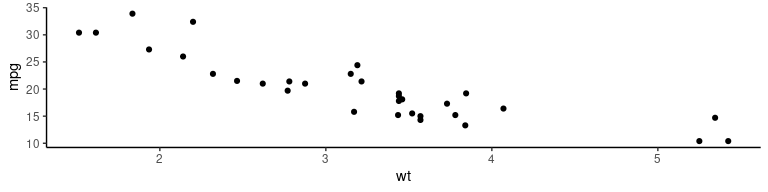

# {#self-intro}


::: {.col style='width:300px'}

### ***Atusy***

{width=300px}

:::

::: {.col style='width:600px'}

* R Markdown関係のコミッタ
* felp、ftExtra、minidownなどパッケージを作ってはTokyoRで紹介している
* Pythonでデータ分析してる
* 
  [blog.atusy.net](https://blog.atusy.net)
* 
  [\@Atsushi776](https://twitter.com/Atsushi776)

:::

# 提供

[](https://github.com/sponsors/atusy)

<https://github.com/sponsors/atusy>

# パッケージの干渉👎 {#conflicts}


```r
mtcars %>% select(mpg)
#> Error in select(., mpg): unused argument (mpg)
```
## 入れ替わってる？！


```r
select
#> function (obj) 
#> UseMethod("select")
#> <bytecode: 0x559b3a8758b0>
#> <environment: namespace:MASS>
```


# パッケージ::関数👎 {#avoid-conflicts}

正直だるい


```r
ggplot2::ggplot(mtcars) +
  ggplot2::aes(wt, mpg) +
  ggplot2::geom_point() +
  ggplot2::theme_classic()
```


# Pythonのアレが欲しい  {#python}


```python
import datetime as dt
dt.date(2020, 9, 19)
#> datetime.date(2020, 9, 19)
```

# 📦importas🎉


```r
remotes::install_github("atusy/importas")
```

CRAN登録は間に合いませんでした……。

スマン！！

## Python風 {#like-python}


```r
ggplot2 %as% gg
gg$ggplot(mtcars) +
  gg$aes(wt, mpg) +
  gg$geom_point() +
  gg$theme_classic()
```


## R風 {#like-r}


```r
gg <- package(ggplot2)
gg$ggplot(mtcars) +
  gg$aes(wt, mpg) +
  gg$geom_point() +
  gg$theme_classic()
```



## 複数に同時


```r
importas(tb = tibble, td = tidyr)
`%>%` <- magrittr::`%>%`

tb$rownames_to_column(mtcars) %>%
  td$nest(data = -rowname)
#> # A tibble: 32 x 2
#>    rowname           data             
#>    <chr>             <list>           
#>  1 Mazda RX4         <tibble [1 × 11]>
#>  2 Mazda RX4 Wag     <tibble [1 × 11]>
#>  3 Datsun 710        <tibble [1 × 11]>
#>  4 Hornet 4 Drive    <tibble [1 × 11]>
#>  5 Hornet Sportabout <tibble [1 × 11]>
#>  6 Valiant           <tibble [1 × 11]>
#>  7 Duster 360        <tibble [1 × 11]>
#>  8 Merc 240D         <tibble [1 × 11]>
#>  9 Merc 230          <tibble [1 × 11]>
#> 10 Merc 280          <tibble [1 × 11]>
#> # … with 22 more rows
```


# 入力補完に対応


# 完全一致のみ許可


```r
gg$ggplo
#> Error: 'ggplo' is not an exported object from 'namespace:ggplot2'
gg$ggplot
#> function (data = NULL, mapping = aes(), ..., environment = parent.frame()) 
#> {
#>     UseMethod("ggplot")
#> }
#> <bytecode: 0x559b3b6d2bf8>
#> <environment: namespace:ggplot2>
```

## 通常の`$`は前方一致


```r
identical(
  mtcars$mpg,
  mtcars$m
)
#> [1] TRUE
```

# ヘルプは見れない


```r
?gg$ggplot
#> Warning in .helpForCall(topicExpr, parent.frame()): no method defined for
#> function '$' and signature 'x = "importas"'
#> Error in .helpForCall(topicExpr, parent.frame()): no documentation for function '$' and signature 'x = "importas"'
```


# 仕組み

## エイリアスの実態

* `importas`クラスオブジェクト
* 実態は名前付きリスト
    * 値はすべて`NULL`
    * エクスポートされたオブジェクトを名前に持つ
    * 名前があるので入力補完が可能


```r
str(gg)
#> List of 518
#>  $ .data                    : NULL
#>  $ .pt                      : NULL
#>  $ .stroke                  : NULL
#>  $ %+%                      : NULL
#>  $ %+replace%               : NULL
#>  $ aes                      : NULL
#>  $ aes_                     : NULL
#>  $ aes_all                  : NULL
#>  $ aes_auto                 : NULL
#>  $ aes_q                    : NULL
#>  $ aes_string               : NULL
#>  $ after_scale              : NULL
#>  $ after_stat               : NULL
#>  $ alpha                    : NULL
#>  $ annotate                 : NULL
#>  $ annotation_custom        : NULL
#>  $ annotation_logticks      : NULL
#>  $ annotation_map           : NULL
#>  $ annotation_raster        : NULL
#>  $ arrow                    : NULL
#>  $ as_labeller              : NULL
#>  $ autolayer                : NULL
#>  $ autoplot                 : NULL
#>  $ AxisSecondary            : NULL
#>  $ benchplot                : NULL
#>  $ binned_scale             : NULL
#>  $ borders                  : NULL
#>  $ calc_element             : NULL
#>  $ combine_vars             : NULL
#>  $ continuous_scale         : NULL
#>  $ Coord                    : NULL
#>  $ coord_cartesian          : NULL
#>  $ coord_equal              : NULL
#>  $ coord_fixed              : NULL
#>  $ coord_flip               : NULL
#>  $ coord_map                : NULL
#>  $ coord_munch              : NULL
#>  $ coord_polar              : NULL
#>  $ coord_quickmap           : NULL
#>  $ coord_sf                 : NULL
#>  $ coord_trans              : NULL
#>  $ CoordCartesian           : NULL
#>  $ CoordFixed               : NULL
#>  $ CoordFlip                : NULL
#>  $ CoordMap                 : NULL
#>  $ CoordPolar               : NULL
#>  $ CoordQuickmap            : NULL
#>  $ CoordSf                  : NULL
#>  $ CoordTrans               : NULL
#>  $ cut_interval             : NULL
#>  $ cut_number               : NULL
#>  $ cut_width                : NULL
#>  $ derive                   : NULL
#>  $ discrete_scale           : NULL
#>  $ draw_key_abline          : NULL
#>  $ draw_key_blank           : NULL
#>  $ draw_key_boxplot         : NULL
#>  $ draw_key_crossbar        : NULL
#>  $ draw_key_dotplot         : NULL
#>  $ draw_key_label           : NULL
#>  $ draw_key_path            : NULL
#>  $ draw_key_point           : NULL
#>  $ draw_key_pointrange      : NULL
#>  $ draw_key_polygon         : NULL
#>  $ draw_key_rect            : NULL
#>  $ draw_key_smooth          : NULL
#>  $ draw_key_text            : NULL
#>  $ draw_key_timeseries      : NULL
#>  $ draw_key_vline           : NULL
#>  $ draw_key_vpath           : NULL
#>  $ dup_axis                 : NULL
#>  $ el_def                   : NULL
#>  $ element_blank            : NULL
#>  $ element_grob             : NULL
#>  $ element_line             : NULL
#>  $ element_rect             : NULL
#>  $ element_render           : NULL
#>  $ element_text             : NULL
#>  $ enexpr                   : NULL
#>  $ enexprs                  : NULL
#>  $ enquo                    : NULL
#>  $ enquos                   : NULL
#>  $ ensym                    : NULL
#>  $ ensyms                   : NULL
#>  $ expand_limits            : NULL
#>  $ expand_scale             : NULL
#>  $ expansion                : NULL
#>  $ expr                     : NULL
#>  $ Facet                    : NULL
#>  $ facet_grid               : NULL
#>  $ facet_null               : NULL
#>  $ facet_wrap               : NULL
#>  $ FacetGrid                : NULL
#>  $ FacetNull                : NULL
#>  $ FacetWrap                : NULL
#>  $ find_panel               : NULL
#>  $ flip_data                : NULL
#>  $ flipped_names            : NULL
#>  $ fortify                  : NULL
#>   [list output truncated]
#>  - attr(*, "class")= chr [1:2] "importas" "list"
#>  - attr(*, "package")= symbol ggplot2
```

## `$`演算子の中身

`::`演算子と同様`getExportedValue`関数を使う


```r
importas:::`$.importas`
#> function(x, name) {
#>   getExportedValue(attr(x, "package", exact = TRUE), substitute(name))
#> }
#> <bytecode: 0x559b4192b200>
#> <environment: namespace:importas>
```


```r
`::`
#> function (pkg, name) 
#> {
#>     pkg <- as.character(substitute(pkg))
#>     name <- as.character(substitute(name))
#>     getExportedValue(pkg, name)
#> }
#> <bytecode: 0x559b39afda60>
#> <environment: namespace:base>
```

## `<-`したエイリアスの居場所

`.GlobalEnv`


```r
ls()
#> [1] "%>%" "gg"
```

## その他のエイリアスの居場所

サーチパスに`attach`した`"importas:alias"`


```r
ls(envir=as.environment("importas:alias"))
#> [1] "gg" "tb" "td"
```

# 余談

## `.GlobalEnv`汚染禁止

importas 0.1.0では`%as%`演算子や`importas`関数も \
`.GlobalEnv`にエイリアスを作っていた

が

> Thanks, but modification of the .GlobalEnv is a policy violation.

## `attach`関数を使おう

- サーチパスを追加
- `.GlobalEnv`汚染の回避に使える
- Good Practice (`?attach`)
    - 基本的には`with`関数で代用せよ
    - どうしても必要なら`on.exit`で`detach`せよ

いや、`.onLoad`で`attach`して、`.unLoad`で`detach`したいんやけど……？

## Good Practice違反禁止？

`attach`したら`on.exit`で`detach`しないと \
R CMD checkに怒られる

回避するには`do.call`を経由しよう。

```r
.onLoad <- function(libname, pkgname) {
  do.call("attach", list(what = NULL, name = "importas:alias"))
}
```

## 黒魔術は黒魔術を呼ぶ

# Enjoy!!
